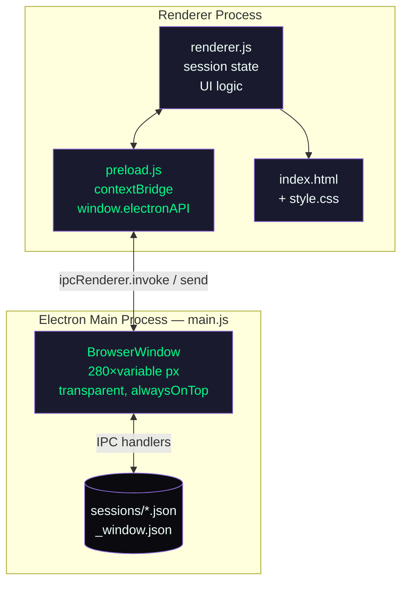
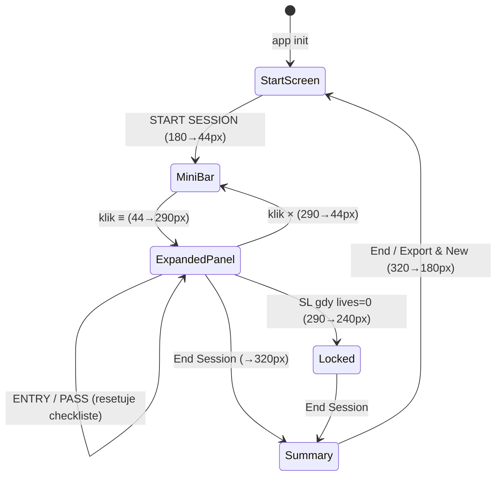

# CLAUDE.md

This file provides guidance to Claude Code (claude.ai/code) when working with code in this repository.

---

## Commands

```bash
# Install dependencies
npm install

# Start the app
npm start
```

No build step, linter, or automated tests.

---

## Architecture

The app is an **Electron desktop overlay** - a transparent, frameless window (280 px) that always stays on top of the screen, intended for SOL traders.

### Process diagram



### Project files

| File | Role |
|------|------|
| `main.js` | Electron main process - creates `BrowserWindow`, handles IPC, writes/reads files |
| `preload.js` | Context bridge - exposes `window.electronAPI` with `contextIsolation: true` |
| `renderer.js` | All UI logic - custom in-memory `session` object, calls `electronAPI.*` for FS |
| `index.html` | Static markup - 3 views: start-screen, hud-container, summary-screen |
| `style.css` | Dark theme with CSS custom properties, animations, `-webkit-app-region` for drag |
| `sessions/*.json` | Persisted trading sessions (auto-save after each action) |
| `sessions/_window.json` | Window position between launches |

---

## Session lifecycle



**Key state rules:**

- `session.locked = true` -> all action buttons are disabled
- ENTRY requires min. 3/4 selected checkboxes (`session.checklist`)
- `session.startedAt` is set on the first trade (not on START SESSION)
- `autoSave()` is called after each action and each passive event

---

## IPC surface

| Channel | Type | Direction | Action |
|-------|-----|----------|-----------|
| `resize-window` | invoke | renderer→main | `win.setSize(280, h)` |
| `save-session` | invoke | renderer→main | Write `sessions/<id>.json` |
| `load-position` | invoke | renderer→main | Read `_window.json` |
| `save-position` | invoke | renderer→main | Write `_window.json` |
| `get-session-ids` | invoke | renderer→main | List `.json` files in `sessions/` |
| `open-sessions-folder` | invoke | renderer→main | `shell.openPath(sessionsDir)` |
| `get-screen-size` | invoke | renderer→main | `screen.getPrimaryDisplay().workAreaSize` |
| `set-ignore-mouse` | send (one-way) | renderer→main | `win.setIgnoreMouseEvents(bool, {forward:true})` |
| `window-position-changed` | send (one-way) | main→renderer | Emitted on the `win.on('move')` event |

---

## Environment variables and secrets

None. The app does not use any environment variables or API keys.
All data is local (JSON files on the user's disk).

---

## Drag regions / click-through

- `-webkit-app-region: drag` is on: `.mini-bar`, `.panel-header`, `#start-screen`
- `-webkit-app-region: no-drag` overrides interactive elements (buttons, inputs, checkboxes)
- Click-through (`setIgnoreMouseEvents`) is toggled by `mousemove` hit-testing in `renderer.js`:

```js
document.addEventListener('mousemove', (e) => {
  const el = document.elementFromPoint(e.clientX, e.clientY);
  const inInteractiveArea = el && el.closest('#hud-container, #start-screen');
  window.electronAPI.setIgnoreMouse(!inInteractiveArea);
});
```

---

## Window heights

| State | CSS height | `resizeWindow()` call |
|------|-------------|----------------------|
| Start screen | 180 px | `resizeWindow(180)` |
| Mini-bar | 44 px | `resizeWindow(44)` |
| Expanded panel | 290 px | `resizeWindow(290)` |
| Locked (lives=0) | 240 px | `resizeWindow(240)` |
| Summary | 320 px | `resizeWindow(320)` |

---

## Session file schema

```json
{
  "session_id": "YYYY-MM-DD_NNN",
  "started_at": "<ISO8601 or null>",
  "ended_at":   "<ISO8601 or null>",
  "config":     { "lives": 3, "sol_limit": 0.15 },
  "summary": {
    "attempts": 0,
    "wins": 0,
    "losses": 0,
    "win_rate": "0.0",
    "passive_events": 0,
    "sl_hits": 0
  },
  "trades": [
    {
      "type": "ENTRY | PASS | SL",
      "at": "<ISO8601>",
      "lives": 3,
      "attempts": 1,
      "wins": 1,
      "losses": 0
    }
  ],
  "window_position": { "x": 10, "y": 10 }
}
```

---

## Known issues / Troubleshooting

| Problem | Cause | Solution |
|---------|-----------|-------------|
| DevTools open automatically | `win.webContents.openDevTools()` in `createWindow()` in `main.js:54` | Remove this line for the production build |
| Window appears off-screen | Old position in `_window.json` after resolution change | Delete `sessions/_window.json` |
| `ENTRY` is always disabled | Min. 3 checkboxes not completed or `session.locked = true` | Select checkboxes, check session state in DevTools |
| Session does not save | `sessions/` does not exist (first start) | `ensureSessionsDir()` creates the directory automatically; check write permissions |

---

## Monitoring / Observability

No external monitoring. Debugging is available through Electron's built-in DevTools (they open automatically in the current version).

Useful places to log in `renderer.js`:

- `console.error('Auto-save failed:', error)` - session write errors
- Live session state: in DevTools, type `session` (the object is in module scope)
