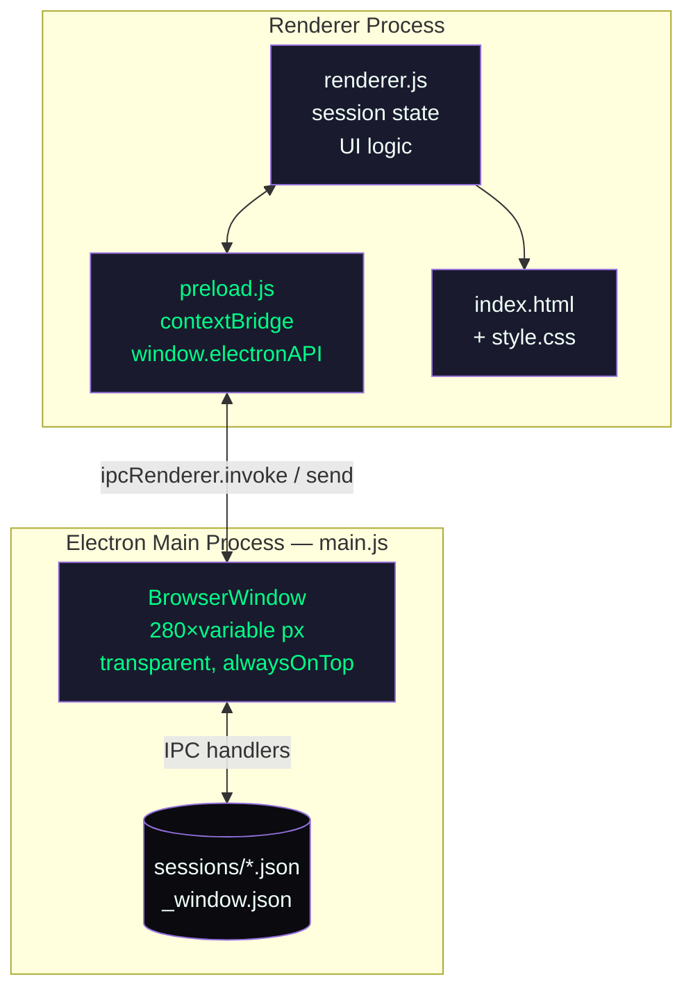
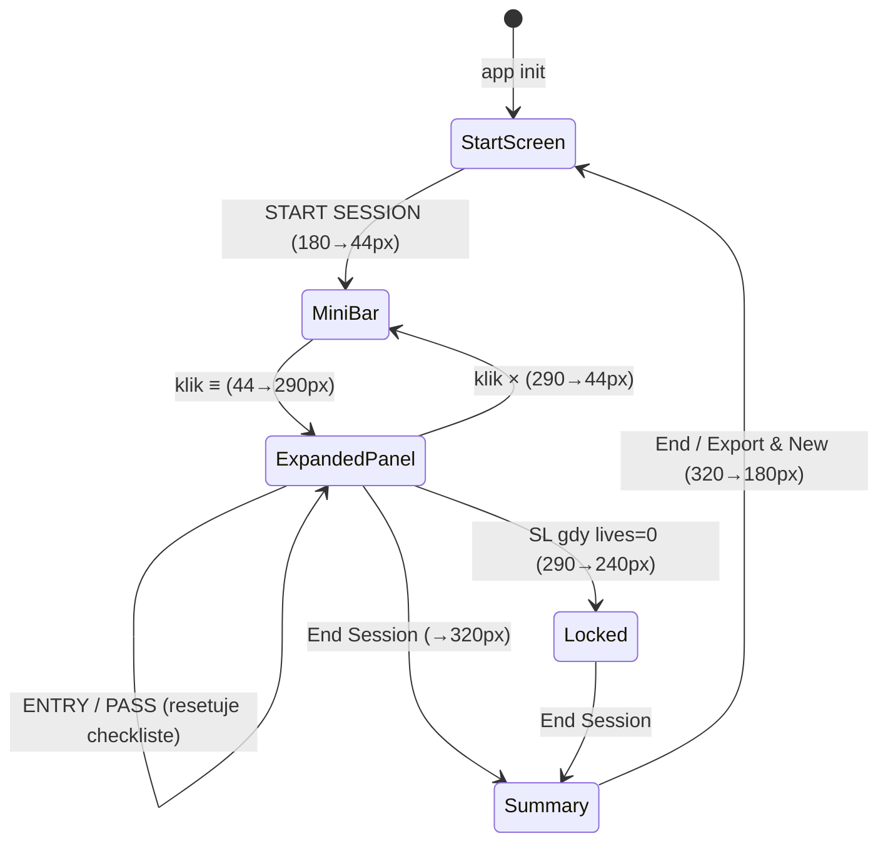

# CLAUDE.md

This file provides guidance to Claude Code (claude.ai/code) when working with code in this repository.

---

## Komendy

```bash
# Instalacja zależności
npm install

# Uruchomienie aplikacji
npm start
```

Brak kroku budowania, lintera ani testów automatycznych.

---

## Architektura

Aplikacja to **Electron desktop overlay** — przezroczyste, frameless okno (280 px) zawsze na wierzchu ekranu, przeznaczone dla traderów SOL.

### Diagram procesów



### Pliki projektu

| Plik | Rola |
|------|------|
| `main.js` | Electron main process — tworzy `BrowserWindow`, obsługuje IPC, zapisuje/czyta pliki |
| `preload.js` | Context bridge — eksponuje `window.electronAPI` z `contextIsolation: true` |
| `renderer.js` | Cała logika UI — własny obiekt `session` w pamięci, wywołuje `electronAPI.*` dla FS |
| `index.html` | Statyczny markup — 3 widoki: start-screen, hud-container, summary-screen |
| `style.css` | Dark theme z CSS custom properties, animacje, `-webkit-app-region` dla drag |
| `sessions/*.json` | Persystowane sesje tradingowe (auto-zapis po każdej akcji) |
| `sessions/_window.json` | Pozycja okna między uruchomieniami |

---

## Cykl życia sesji



**Kluczowe reguły stanu:**

- `session.locked = true` → wszystkie przyciski akcji disabled
- ENTRY wymaga min. 3/4 checkboxów zaznaczonych (`session.checklist`)
- `session.startedAt` ustawiane przy pierwszym trade (nie przy START SESSION)
- `autoSave()` wywoływany po każdej akcji i przy każdym zdarzeniu pasywnym

---

## IPC surface

| Kanał | Typ | Kierunek | Działanie |
|-------|-----|----------|-----------|
| `resize-window` | invoke | renderer→main | `win.setSize(280, h)` |
| `save-session` | invoke | renderer→main | Zapis `sessions/<id>.json` |
| `load-position` | invoke | renderer→main | Odczyt `_window.json` |
| `save-position` | invoke | renderer→main | Zapis `_window.json` |
| `get-session-ids` | invoke | renderer→main | Lista plików `.json` w `sessions/` |
| `open-sessions-folder` | invoke | renderer→main | `shell.openPath(sessionsDir)` |
| `get-screen-size` | invoke | renderer→main | `screen.getPrimaryDisplay().workAreaSize` |
| `set-ignore-mouse` | send (one-way) | renderer→main | `win.setIgnoreMouseEvents(bool, {forward:true})` |
| `window-position-changed` | send (one-way) | main→renderer | Emitowane na zdarzenie `win.on('move')` |

---

## Zmienne środowiskowe i sekrety

Brak. Aplikacja nie używa żadnych zmiennych środowiskowych ani kluczy API.
Wszystkie dane są lokalne (pliki JSON na dysku użytkownika).

---

## Regiony drag / click-through

- `-webkit-app-region: drag` jest na: `.mini-bar`, `.panel-header`, `#start-screen`
- `-webkit-app-region: no-drag` nadpisuje interaktywne elementy (przyciski, inputy, checkboksy)
- Click-through (`setIgnoreMouseEvents`) przełączany przez `mousemove` hit-testing w `renderer.js`:

```js
document.addEventListener('mousemove', (e) => {
  const el = document.elementFromPoint(e.clientX, e.clientY);
  const inInteractiveArea = el && el.closest('#hud-container, #start-screen');
  window.electronAPI.setIgnoreMouse(!inInteractiveArea);
});
```

---

## Wysokości okna

| Stan | Wysokość CSS | `resizeWindow()` call |
|------|-------------|----------------------|
| Start screen | 180 px | `resizeWindow(180)` |
| Mini-bar | 44 px | `resizeWindow(44)` |
| Expanded panel | 290 px | `resizeWindow(290)` |
| Locked (lives=0) | 240 px | `resizeWindow(240)` |
| Summary | 320 px | `resizeWindow(320)` |

---

## Schemat pliku sesji

```json
{
  "session_id": "YYYY-MM-DD_NNN",
  "started_at": "<ISO8601 lub null>",
  "ended_at":   "<ISO8601 lub null>",
  "config":     { "lives": 3, "sol_limit": 0.15 },
  "summary": {
    "attempts": 0,
    "wins": 0,
    "losses": 0,
    "win_rate": "0.0",
    "passive_events": 0,
    "sl_hits": 0
  },
  "trades": [
    {
      "type": "ENTRY | PASS | SL",
      "at": "<ISO8601>",
      "lives": 3,
      "attempts": 1,
      "wins": 1,
      "losses": 0
    }
  ],
  "window_position": { "x": 10, "y": 10 }
}
```

---

## Znane problemy / Troubleshooting

| Problem | Przyczyna | Rozwiązanie |
|---------|-----------|-------------|
| DevTools otwierają się automatycznie | `win.webContents.openDevTools()` w `createWindow()` w `main.js:54` | Usuń tę linię dla buildu produkcyjnego |
| Okno pojawia się poza ekranem | Stara pozycja w `_window.json` po zmianie rozdzielczości | Usuń `sessions/_window.json` |
| `ENTRY` zawsze disabled | Nie ukończono min. 3 checkboxów lub `session.locked = true` | Zaznacz checkboksy, sprawdź stan sesji w DevTools |
| Sesja nie zapisuje się | `sessions/` nie istnieje (pierwszy start) | `ensureSessionsDir()` tworzy katalog automatycznie; sprawdź prawa do zapisu |

---

## Monitoring / Observability

Brak zewnętrznego monitoringu. Debug dostępny przez wbudowane DevTools Electrona (otwierają się automatycznie w obecnej wersji).

Użyteczne miejsca do logowania w `renderer.js`:

- `console.error('Auto-save failed:', error)` — błędy zapisu sesji
- Stan sesji live: w DevTools wpisz `session` (obiekt jest w scope modułu)
